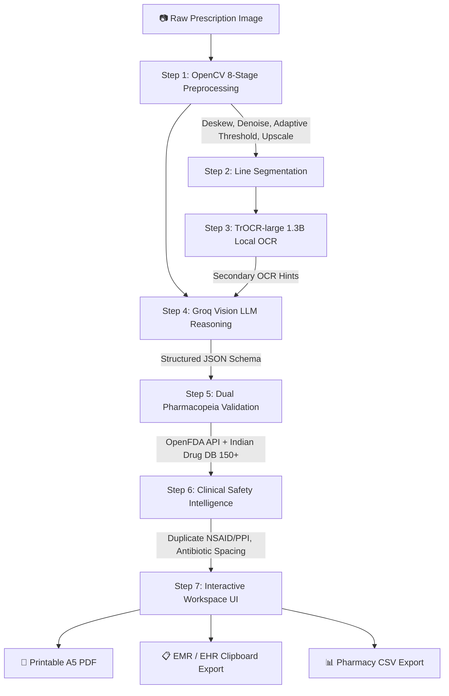

# PRISM — Prescription Recognition and Intelligent Safety for Medication

> **AI-Powered Handwritten Prescription Digitization & Clinical Safety Intelligence for Indian Healthcare**  
> *Transforming faint, handwritten doctor prescriptions into verified, structured digital records in seconds with real-time drug interaction checks.*

---

## 🌟 Overview

In India, over **7 million prescriptions** are handwritten daily on clinic notepads and hospital letterheads. The extreme variance in doctor handwriting leads to frequent misinterpretations, pharmacy dispensing errors, incorrect patient dosages, and adverse drug events.

**PRISM** (*Prescription Recognition and Intelligent Safety for Medication*) bridges this critical gap. By combining classical computer vision, local transformer OCR, frontier vision-language reasoning, and multi-source pharmacopeia databases, PRISM delivers an accessible, clinical-grade digitization suite that:
1. **Reads Complex Cursive & Abbreviations**: Deciphers Indian doctor handwriting (brand names, dosages, frequencies like OD/BD/TDS, durations).
2. **Flags Uncertainties Honestly**: Low-confidence lines are highlighted for human review rather than silently hallucinated.
3. **Evaluates Clinical Drug Safety**: Automatically alerts clinicians to duplicate therapies (e.g., overlapping NSAIDs or PPIs) and antibiotic spacing requirements.
4. **Empowers Clinicians**: Features an image inspection zoom lightbox, inline editable medicine table, manual medicine additions, EMR clinical summary copy, CSV export, and printable A5 digital PDF records.

---

## 🏗️ Architecture & Pipeline



### 1. OpenCV Preprocessing & Line Segmentation
- **Hough Line Deskewing**: Automatically straightens tilted mobile camera photos.
- **Adaptive Gaussian Thresholding & Contrast Stretching**: Strips heavy shadows and paper wrinkles.
- **Dynamic Horizontal Kernel Morphological Segmentation**: Splits multi-line prescriptions into individual lines.

### 2. TrOCR-Large Handwriting Recognition (1.3B)
- Microsoft's vision encoder-decoder model processes segmented lines to provide character-level probability distributions and confidence scores ($0.0 - 1.0$).

### 3. Vision LLM Multimodal Reasoning (`qwen/qwen3.8-27b`)
- Sends the raw prescription image directly to Groq's high-speed vision model. Uses the TrOCR output as secondary context to resolve doctor handwriting and Indian pharmaceutical brand names (e.g., *Zincovit*, *Rabemar*, *Dolo 650*, *Pantocid*).

### 4. Dual Pharmacopeia Validation
- **OpenFDA API**: Queries international generic formulations and active ingredients.
- **Indian Drug Database (150+ Brands)**: Verifies domestic brand names, standard dosage forms, and common schedules.

### 5. Clinical Safety Intelligence
- **Analgesic / Antipyretic Checks**: Detects concurrent prescription of multiple NSAIDs/analgesics (e.g., Paracetamol + Aceclofenac + Ibuprofen).
- **Gastric Acid Suppressant Checks**: Flags duplicate PPI / H2-blocker regimens (e.g., Rabeprazole + Pantoprazole).
- **Chelation Warnings**: Recommends 2-hour spacing when mineral multivitamins (Zinc/Iron/Calcium) are prescribed alongside fluoroquinolone or tetracycline antibiotics.

---

## 💻 Tech Stack

| Layer | Technologies |
|---|---|
| **Frontend** | Next.js 14 (App Router), TypeScript, Tailwind CSS, Lucide Icons |
| **Backend** | Python 3.11, FastAPI, Uvicorn, SQLite, SQLAlchemy, Pydantic v2 |
| **Handwriting OCR** | `microsoft/trocr-large-handwritten` (Hugging Face Transformers, PyTorch) |
| **Vision LLM** | Groq Cloud API (`qwen/qwen3.8-27b` native vision multimodal reasoning) |
| **Validation** | OpenFDA REST API + Custom Indian Pharmacopeia Database |
| **PDF Generation**| ReportLab (A5 prescription format with color-coded safety indicators) |
| **Alternative UI** | Gradio 4.44 (Hugging Face Spaces demo) |

---

## 📋 Model Declaration

| Model | Parameters | Tier | Role | Deployment | Inference Cost |
|---|---|---|---|---|---|
| **microsoft/trocr-large-handwritten** | 1.3B | Tier 2 | Line-level handwriting OCR | Local CPU / GPU | $0.000 |
| **qwen/qwen3.8-27b** (Groq) | 27B | Tier 1 | Direct vision reasoning & JSON extraction | Groq API Free Tier | ~$0.001 |
| **OpenFDA Drug API** | N/A | Rule-based | International drug validation | api.fda.gov | $0.000 |
| **Indian Pharmacopeia DB** | 150+ Drugs | Rule-based | Local brand verification | In-memory lookup | $0.000 |

- **Total cost per prescription**: `~$0.001`
- **Total latency**: `~12–25s` on CPU (`~3–6s` with CUDA GPU acceleration).

---

## 🚀 Quickstart Guide

### Prerequisites
- Python 3.10 or 3.11 (Python 3.11 recommended)
- Node.js 18+ and npm
- Groq API Key (Free tier from [console.groq.com](https://console.groq.com))

### 1. One-Click Setup (Windows)
Run the automated environment setup script from the project root:
```cmd
setup.bat
```
To launch both the FastAPI backend and Next.js frontend simultaneously:
```cmd
start_local.bat
```

### 2. Manual Backend Setup
```bash
cd backend

# Create virtual environment (Python 3.11)
python -m venv .venv
source .venv/bin/activate  # Windows: .venv\Scripts\activate

# Install dependencies
pip install -r requirements.txt

# Configure environment
cp .env.example .env
# Open .env and add your GROQ_API_KEY
```

Run the backend server:
```bash
uvicorn main:app --host 127.0.0.1 --port 8000
```
- API Docs & Swagger UI: `http://127.0.0.1:8000/docs`
- Health check: `http://127.0.0.1:8000/health`

### 3. Manual Frontend Setup
```bash
cd frontend

# Install dependencies
npm install

# Start Next.js dev server
npm run dev
```
Open `http://localhost:3000` in your browser.

### 4. Standalone Gradio Demo (Hugging Face Spaces)
```bash
cd backend
python app.py
```
Open `http://localhost:7860` for the standalone demo interface.

---

## 📁 Repository Structure

```
prescription_reader/
├── backend/
│   ├── main.py              # FastAPI application & API endpoints
│   ├── pipeline.py          # End-to-end orchestration pipeline
│   ├── preprocess.py        # OpenCV deskewing, thresholding, line segmentation
│   ├── ocr.py               # TrOCR singleton engine with confidence scoring
│   ├── extractor.py         # Vision LLM direct extraction via Groq API
│   ├── validator.py         # Parallel OpenFDA & Indian drug database validation
│   ├── pdf_generator.py     # ReportLab A5 PDF generation (PRISM formatted)
│   ├── database.py          # SQLite database storage & statistics
│   ├── models.py            # Pydantic schemas (ExtractionResult, MedicineItem)
│   ├── indian_drugs.py      # Indian pharmaceutical database (150+ drugs)
│   ├── app.py               # Gradio web interface
│   ├── requirements.txt     # Python backend dependencies
│   └── .env.example         # Environment template
├── frontend/
│   ├── app/
│   │   ├── layout.tsx       # Root layout & PRISM metadata
│   │   ├── page.tsx         # Main entry mounting PrescriptionWorkspace
│   │   └── result/[id]/     # Dynamic result route synchronized with workspace
│   ├── components/
│   │   └── PrescriptionWorkspace.tsx # Full-featured clinical workspace UI
│   ├── lib/
│   │   ├── api.ts           # Frontend API client & PDF exporter
│   │   └── types.ts         # TypeScript definitions
│   ├── public/
│   │   └── sample_prescription.jpeg  # Sample test prescription
│   └── package.json
├── setup.bat                # Automated virtualenv & dependency installation
├── start_local.bat          # One-click launcher for frontend & backend
└── README.md
```

---

## 🔒 Safety, Privacy & Limitations

1. **Honest Confidence Scoring**: Medicines with confidence under the user-selected threshold (70%–90%) or unverified against the drug databases are flagged in the **"Needs Human Look"** alert box.
2. **Clinical Copy Disclaimer**: PRISM generates digital reference records for clinical assistance and pharmacy dispensing verification; it does not replace the registered medical practitioner's original prescription.
3. **Regional Scripts**: Currently optimized for English prescriptions and common Indian brand names. Support for regional vernacular scripts (Kannada, Telugu, Hindi, Tamil) is slated for future releases.

---

## 📄 License

MIT License — see [LICENSE](file:///e:/prescription_reader/LICENSE) for details.
